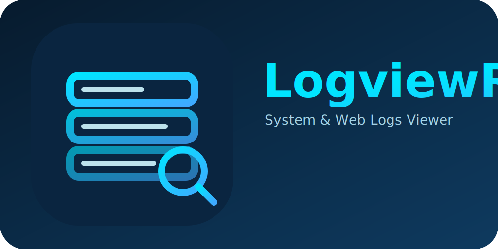

# LogviewR - Log Viewer Application

<div align="center">




**Application de visualisation de logs en temps réel pour Apache, Nginx, NPM et logs système**

[Installation](#-installation) | [Fonctionnalités](#-fonctionnalités) | [Plugins](#-plugins) | [Configuration](#-configuration) | [Documentation](#-documentation)

</div>

---

## 📋 Table des matières

- [À propos](#-à-propos)
- [Fonctionnalités](#-fonctionnalités)
- [Plugins](#-plugins)
- [Installation](#-installation)
- [Configuration](#-configuration)
- [Options avancées](#-options-avancées)
- [Atouts](#-atouts)
- [Documentation](#-documentation)
- [Contribution](#-contribution)
- [Licence](#-licence)

---

## 🎯 À propos

**LogviewR** est une application web moderne et performante pour visualiser et analyser les logs en temps réel. Conçue pour les administrateurs système et les développeurs, elle offre une interface intuitive pour surveiller les logs de vos serveurs web et systèmes.

### Caractéristiques principales

- 🚀 **Temps réel** : Streaming WebSocket pour un suivi en direct des logs
- 🎨 **Interface moderne** : Design épuré avec thèmes personnalisables
- 🔍 **Recherche avancée** : Filtres multiples (niveau, date, IP, méthode HTTP, etc.)
- 📊 **Statistiques** : Tableaux de bord avec statistiques détaillées par plugin
- 🔐 **Sécurisé** : Authentification JWT, gestion des rôles, permissions par plugin
- 🐳 **Docker-ready** : Déploiement simplifié avec Docker Compose
- ⚡ **Performant** : Optimisations pour gérer des milliers de fichiers de logs

---

## ✨ Fonctionnalités

### Visualisation des logs

- **Tableau interactif** : Colonnes dynamiques selon le type de log
- **Tri adaptatif** : Tri automatique par type (date, nombre, IP, texte)
- **Badges colorés** : Visualisation intuitive des niveaux, codes HTTP, IP, hostnames
- **Formatage intelligent** : Mise en forme automatique selon le type de colonne
- **Pagination** : Navigation efficace dans les grandes quantités de logs
- **Masquage lignes vides** : Affichage uniquement des lignes pertinentes

### Filtres et recherche

- **Recherche texte** : Recherche dans tous les champs des logs
- **Filtres par niveau** : INFO, WARN, ERROR, DEBUG, etc.
- **Filtres par date** : Sélection de plage de dates avec calendrier
- **Filtres par IP** : Recherche par adresse IP source
- **Filtres HTTP** : Méthode, code de statut, URL
- **Filtres spécifiques** : Filtres adaptés selon le type de log

### Mode Live

- **Suivi en temps réel** : Mode "Live" pour suivre les nouveaux logs au fur et à mesure
- **WebSocket** : Connexion WebSocket pour des mises à jour instantanées
- **Reconnexion automatique** : Gestion automatique des déconnexions
- **Indicateur de statut** : Affichage visuel de l'état de la connexion

### Gestion des fichiers

- **Détection automatique** : Scan automatique des fichiers de logs disponibles
- **Regroupement intelligent** : Regroupement par catégorie et nom de base
- **Fichiers rotatifs** : Gestion des fichiers rotatifs (access.log.1, access.log.2, etc.)
- **Fichiers compressés** : Support des fichiers `.gz` avec décompression automatique
- **Indicateurs visuels** : Icônes distinctives pour fichiers compressés
- **Filtres avancés** : Filtre "Tous" / "Regex uniquement" pour les fichiers gérés

### Regex personnalisées

- **Éditeur intégré** : Éditeur de regex avec test en temps réel
- **Regex par fichier** : Configuration de regex personnalisées par fichier
- **Regex par défaut** : Regex par défaut pour chaque type de log
- **Génération automatique** : Génération de regex à partir d'exemples de logs
- **Validation** : Validation de la syntaxe avant sauvegarde

### Statistiques et analytique

- **Statistiques par plugin** : Nombre de fichiers, fichiers lisibles/non lisibles
- **Plus gros fichiers** : Top 10 des fichiers les plus volumineux
- **Statistiques en temps réel** : Mise à jour automatique des statistiques
- **Tableaux de bord** : Vue d'ensemble de tous les plugins actifs

---

## 🔌 Plugins

LogviewR supporte plusieurs plugins pour différents types de logs :

### 🖥️ Host System

**Plugin pour les logs système Linux/Unix**

- **Types de logs supportés** :
  - Syslog (`/var/log/syslog`, `/var/log/messages`)
  - Auth logs (`/var/log/auth.log`, `/var/log/secure`)
  - Kernel logs (`/var/log/kern.log`)
  - Daemon logs (`/var/log/daemon.log`)
  - Mail logs (`/var/log/mail.log`)
  - Logs personnalisés

- **Fonctionnalités** :
  - Détection automatique de l'environnement Docker
  - Support des formats syslog standard (RFC 3164, RFC 5424)
  - Parsing des timestamps avec gestion des timezones
  - Extraction des niveaux de sévérité
  - Fichiers personnalisés configurables

- **Configuration** :
  - Chemin de base configurable (par défaut : `/var/log` ou `/host/logs` en Docker)
  - Patterns de fichiers personnalisables
  - Regex personnalisées par type de log

### 🌐 Apache

**Plugin pour les logs Apache HTTP Server**

- **Types de logs supportés** :
  - Access logs (formats Combined, Common, VHost)
  - Error logs (formats standard et étendus)

- **Fonctionnalités** :
  - Support des formats Virtual Host
  - Support IPv4 et IPv6
  - Extraction des champs : IP, timestamp, méthode HTTP, URL, code de statut, taille, referer, user-agent
  - Parsing des erreurs avec extraction du module, niveau, PID, TID, client IP
  - Regex par défaut pour chaque format
  - Regex personnalisées par fichier

- **Configuration** :
  - Fichiers de logs personnalisés configurables
  - Regex par défaut modifiables
  - Support des fichiers compressés (.gz)

### 🚀 Nginx

**Plugin pour les logs Nginx**

- **Types de logs supportés** :
  - Access logs (formats Combined, Common, Main, Extended)
  - Error logs

- **Fonctionnalités** :
  - Support de multiples formats de logs Nginx
  - Extraction complète des champs HTTP
  - Parsing des timestamps avec gestion des timezones
  - Regex compatibles avec fail2ban et ELK
  - Regex par défaut pour chaque format

- **Configuration** :
  - Fichiers de logs personnalisés configurables
  - Regex par défaut modifiables
  - Support des fichiers compressés (.gz)

### 🔄 Nginx Proxy Manager (NPM)

**Plugin pour les logs Nginx Proxy Manager**

- **Types de logs supportés** :
  - Access logs (formats standard avec cache, sans cache, custom combined, extended)
  - Error logs

- **Fonctionnalités** :
  - Support de 5 formats de logs NPM différents
  - Détection automatique du format
  - Extraction des champs : cache, upstream status, gzip ratio, etc.
  - Gestion des sous-domaines (proxy-host-xxx_access.log)
  - Regex par défaut pour chaque format

- **Configuration** :
  - Fichiers de logs personnalisés configurables
  - Regex par défaut modifiables
  - Support des fichiers compressés (.gz)

---

## 🚀 Installation

### Prérequis

- Docker et Docker Compose  
 

### Installation avec Docker (Recommandé)

LogviewR propose plusieurs fichiers Docker Compose selon votre usage :

#### Production (`docker-compose.yml`)

Pour un déploiement en production avec l'image pré-construite depuis le registry :

1. **Cloner le dépôt** :
   ```bash
   git clone https://github.com/Erreur32/LogviewR.git
   cd LogviewR
   ```

2. **Créer le fichier `.env`** :
   ```bash
   # Générer un secret JWT sécurisé
   JWT_SECRET=$(openssl rand -base64 32)
   echo "JWT_SECRET=$JWT_SECRET" > .env
   echo "DASHBOARD_PORT=7500" >> .env
   ```

3. **Lancer avec Docker Compose** :
   ```bash
   docker-compose up -d
   ```

4. **Accéder à l'application** :
   Ouvrez votre navigateur à l'adresse : `http://localhost:7500`

#### Build local (`docker-compose.local.yml`)

Pour construire l'image localement (utile pour tester avant de publier) :

```bash
docker-compose -f docker-compose.local.yml up -d --build
```

#### Développement (`docker-compose.dev.yml`)

Pour le développement avec hot-reload :

```bash
# Utiliser un nom de projet différent pour éviter les conflits avec la prod
docker-compose -f docker-compose.dev.yml -p logviewr-dev up --build
```

**Note** : Les fichiers `docker-compose.dev.yml` et `docker-compose.local.yml` sont fournis à titre d'exemple pour le développement. Pour la production, utilisez `docker-compose.yml` qui utilise l'image officielle depuis le registry.

#### Première connexion

- Si aucun utilisateur n'existe, un formulaire d'inscription s'affichera automatiquement
- Créez votre premier compte administrateur (nom d'utilisateur, email, mot de passe)
- Le premier utilisateur créé obtient automatiquement le rôle `admin`
- Après l'inscription, vous serez automatiquement connecté
- ⚠️ **Important** : Changez votre mot de passe après la première connexion si nécessaire

### Installation en développement

1. **Cloner le dépôt** :
   ```bash
   git clone https://github.com/Erreur32/LogviewR.git
   cd LogviewR
   ```

2. **Installer les dépendances** :
   ```bash
   npm install
   ```

3. **Créer le fichier `.env`** :
   ```bash
   JWT_SECRET=dev_secret_change_in_production
   DASHBOARD_PORT=7500
   ```

4. **Lancer en mode développement** :
   ```bash
   npm run dev
   ```

5. **Accéder à l'application** :
   - Frontend : `http://localhost:5174`
   - Backend : `http://localhost:3004`

6. **Première connexion** :
   - Si aucun utilisateur n'existe, un formulaire d'inscription s'affichera automatiquement
   - Créez votre premier compte administrateur (nom d'utilisateur, email, mot de passe)
   - Le premier utilisateur créé obtient automatiquement le rôle `admin`
   - Après l'inscription, vous serez automatiquement connecté

---

## 🔐 Première connexion

Lors du premier démarrage de LogviewR, si aucun utilisateur n'existe dans la base de données :

1. **Un formulaire d'inscription s'affiche automatiquement**
   - Remplissez les champs requis :
     - **Nom d'utilisateur** : Votre identifiant de connexion
     - **Email** : Votre adresse email
     - **Mot de passe** : Minimum 8 caractères
     - **Confirmer le mot de passe** : Répétez le mot de passe
   
2. **Le premier utilisateur est automatiquement admin**
   - Aucun compte par défaut n'est créé
   - Vous choisissez vos propres identifiants
   - Le premier utilisateur créé obtient le rôle `admin` automatiquement

3. **Connexion automatique**
   - Après l'inscription réussie, vous êtes automatiquement connecté
   - Vous pouvez immédiatement commencer à utiliser LogviewR

4. **Connexions suivantes**
   - Utilisez vos identifiants pour vous connecter
   - Le modal de connexion s'affichera si vous n'êtes pas authentifié

⚠️ **Note de sécurité** : Si un message d'alerte concernant le `JWT_SECRET` s'affiche, suivez les instructions pour configurer un secret sécurisé avant de continuer.

---

## ⚙️ Configuration

### Variables d'environnement

| Variable | Description | Défaut | Requis |
|----------|-------------|--------|--------|
| `JWT_SECRET` | Secret pour signer les tokens JWT | - | ✅ Oui |
| `DASHBOARD_PORT` | Port du dashboard | `7500` | Non |
| `HOST_IP` | IP de la machine hôte | Auto-détection | Non |
| `CONFIG_FILE_PATH` | Chemin du fichier de configuration externe | `/app/config/logviewr.conf` | Non |
| `ADM_GID` | GID du groupe adm sur l'hôte (pour lire les fichiers de logs) | `4` | Non |
| `HOST_ROOT_PATH` | Chemin racine du système hôte monté dans le conteneur | `/host` | Non |

### Permissions des fichiers de logs système

Le plugin **Host System Logs** nécessite l'accès en lecture aux fichiers de logs système. Par défaut, ces fichiers appartiennent à `root:adm` avec des permissions `640` (lecture pour root et le groupe adm).

#### Configuration automatique

Le conteneur Docker est automatiquement configuré pour :
- Ajouter l'utilisateur `node` au groupe `adm` (GID 4)
- Permettre la lecture des fichiers appartenant à `root:adm`

#### Vérification du GID du groupe adm

Pour vérifier que le GID correspond entre l'hôte et le conteneur :

```bash
# Sur l'hôte
getent group adm | cut -d: -f3

# Dans le conteneur
docker exec logviewr id
```

Si le GID est différent de 4, ajoutez dans votre fichier `.env` :
```bash
ADM_GID=votre_gid
```

#### Fichiers avec permissions restrictives

Certains fichiers de logs peuvent avoir des permissions plus restrictives (`600` - lecture/écriture pour root uniquement) :

**Exemples de fichiers problématiques :**
- `/var/log/php8.0-fpm.log` (appartient à `root:root` avec `600`)
- `/var/log/rkhunter.log.1` (appartient à `root:root` avec `600`)

**Solution :** Modifier les permissions sur l'hôte pour permettre la lecture par le groupe `adm` :

```bash
# Changer le groupe en adm et ajouter la lecture pour le groupe
sudo chgrp adm /var/log/php8.0-fpm.log*
sudo chmod 640 /var/log/php8.0-fpm.log*

sudo chgrp adm /var/log/rkhunter.log*
sudo chmod 640 /var/log/rkhunter.log*
```

**Vérification après modification :**
```bash
# Vérifier les permissions
ls -la /var/log/php8.0-fpm.log
ls -la /var/log/rkhunter.log.1

# Devrait afficher : -rw-r----- 1 root adm (640)
```

**Note de sécurité :** Modifier les permissions des fichiers de logs pour permettre la lecture par le groupe `adm` est une pratique standard sur les systèmes Linux. Le groupe `adm` est conçu pour permettre l'accès aux fichiers de logs aux administrateurs système.

### Configuration Docker

#### Montage des volumes

Pour accéder aux logs de votre système hôte, montez le répertoire `/var/log` :

```yaml
volumes:
  - /var/log:/host/logs:ro
```

#### Montage optionnel de répertoires spécifiques

Pour un accès direct aux logs sans le préfixe `/host/` :

```yaml
volumes:
  - /var/log/apache2:/var/log/apache2:ro    # Apache logs
  - /var/log/nginx:/var/log/nginx:ro        # Nginx logs
  - /var/log/npm:/var/log/npm:ro            # NPM logs
```

### Configuration des plugins

Chaque plugin peut être configuré depuis l'interface d'administration :

1. **Accéder aux paramètres** : Menu → Paramètres → Plugins
2. **Sélectionner un plugin** : Cliquer sur la carte du plugin
3. **Configurer les options** :
   - Chemin de base des logs
   - Patterns de fichiers
   - Fichiers personnalisés
   - Regex par défaut
   - Option de lecture des fichiers compressés


---

## 🌟 Atouts

<details>
<summary><strong>⚡ Performance</strong></summary>

- ⚡ **Chargement optimisé** : Mode quick pour affichage rapide
- 🚀 **Chargement en deux phases** : Quick stats → Complete stats
- 📊 **Gestion efficace** : Optimisé pour gérer des milliers de fichiers
- 💾 **Décompression intelligente** : Support `.gz` avec gestion mémoire optimisée

</details>

<details>
<summary><strong>🎨 Interface utilisateur</strong></summary>

- 🎨 **Design moderne** : Interface épurée et intuitive
- 🌈 **Thèmes personnalisables** : 6 thèmes disponibles (dark, glass, modern, nightly, neon, elegant)
- 📱 **Responsive** : Interface adaptée à tous les écrans
- 🔍 **Recherche avancée** : Filtres multiples et recherche texte
- 🎯 **Badges colorés** : Visualisation intuitive avec couleurs cohérentes

</details>

<details>
<summary><strong>🔐 Sécurité</strong></summary>

- 🔐 **Authentification JWT** : Tokens sécurisés avec expiration configurable
- 👥 **Gestion des rôles** : Admin, User, Viewer avec permissions granulaires
- 🛡️ **Protection CSRF** : Protection contre les attaques CSRF
- 🔒 **Mots de passe hashés** : Utilisation de bcrypt (10 rounds)
- 🚫 **Protection brute force** : Verrouillage de compte après tentatives échouées

</details>

<details>
<summary><strong>🔌 Extensibilité</strong></summary>

- 🔌 **Architecture modulaire** : Système de plugins extensible
- 📝 **Regex personnalisables** : Configuration flexible des patterns
- 🎛️ **Configuration par plugin** : Options spécifiques à chaque plugin
- 🔄 **API REST complète** : Intégration facile avec d'autres outils

</details>

<details>
<summary><strong>🔄 Fiabilité</strong></summary>

- 🔄 **Reconnexion automatique** : Gestion automatique des déconnexions WebSocket
- 📊 **Statistiques en temps réel** : Mise à jour automatique des métriques
- 🐛 **Gestion d'erreurs** : Gestion robuste des erreurs avec messages clairs
- 📈 **Monitoring** : Statistiques détaillées par plugin

</details>

---

## 📚 Documentation

### Guides utilisateur

- **[Guides des parsers](server/plugins/PARSERS_HELP.md)** : Guide général des parsers et formats supportés
- **[NPM Parser Help](server/plugins/npm/NPM_PARSER_HELP.md)** : Formats et regex pour NPM
- **[Nginx Parser Help](server/plugins/nginx/NGINX_PARSER_HELP.md)** : Formats et regex pour Nginx

 
---

## 🤝 Contribution

Les contributions sont les bienvenues ! Pour plus d'informations sur la contribution.
---

## 📄 Licence

Ce projet est sous licence MIT. Voir le fichier [LICENSE](LICENSE) pour plus de détails.

---

## 🙏 Remerciements

- [React](https://react.dev/) - Bibliothèque UI
- [Express.js](https://expressjs.com/) - Framework web Node.js
- [Tailwind CSS](https://tailwindcss.com/) - Framework CSS
- [Zustand](https://github.com/pmndrs/zustand) - Gestion d'état
- [Lucide React](https://lucide.dev/) - Icônes

---

<div align="center">

**Fait avec ❤️ pour les administrateurs système et développeurs**

[Issues](https://github.com/Erreur32/LogviewR/issues) | [Discussions](https://github.com/Erreur32/LogviewR/discussions) | [Wiki](https://github.com/Erreur32/LogviewR/wiki)

</div>
