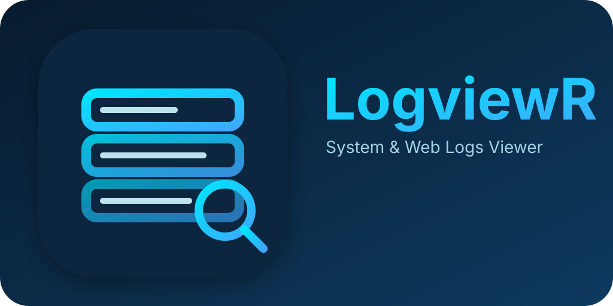

# LogviewR - Log Viewer Application

<div align="center">

 





[](https://github.com/Erreur32/LogviewR/actions/workflows/docker-publish.yml)
[](https://github.com/Erreur32/LogviewR/security/code-scanning)
[](https://scorecard.dev/viewer/?uri=github.com/Erreur32/LogviewR)
[](https://sonarcloud.io/summary/overall?id=Erreur32_LogviewR)
[](https://github.com/Erreur32/LogviewR/actions/workflows/snyk.yml)

**Real-time log viewer for Apache, Nginx, NPM, system logs and Fail2ban**

[README en Français](README.fr.md) | [Installation](#-installation) | [Plugins](#-plugins) | [Configuration](#%EF%B8%8F-configuration) | [Reverse Proxy](#-reverse-proxy) | [Documentation](#-documentation)

</div>


---

## 📋 Table of Contents

- [Installation](#-installation)
- [Plugins](#-plugins)
- [Configuration](#%EF%B8%8F-configuration)
- [Reverse Proxy](#-reverse-proxy)
- [System Log Access](#-system-log-access)
- [Documentation](#-documentation)
- [Contribution](#-contribution)
- [License](#-license)

---

## 🎯 About

**LogviewR** - real-time log viewer for Apache, Nginx, NPM, system logs and Fail2ban.

- 🚀 **Real-time** via WebSocket
- 🔍 **Filters**: level, date, IP, HTTP method…
- 📊 **Statistics** and dashboards per plugin
- 🔐 **JWT auth**, role management
- 🐳 **Docker-ready**

---

## 🔌 Plugins

<details>
<summary><strong>🖥️ Host System</strong> - Linux/Unix system logs</summary>

- Syslog, auth, kernel, daemon, mail, custom logs
- Automatic Docker environment detection
- RFC 3164 / RFC 5424 support
- Configurable base path (`/var/log` or `/host/logs` in Docker)

</details>

<details>
<summary><strong>🌐 Apache</strong> - Apache HTTP Server logs</summary>

- Access logs (Combined, Common, VHost) + Error logs
- IP, timestamp, HTTP method, status code, referer, user-agent extraction
- Editable default regex, `.gz` support

</details>

<details>
<summary><strong>🚀 Nginx</strong> - Nginx logs</summary>

- Access logs (Combined, Common, Main, Extended) + Error logs
- Timestamp parsing with timezone handling
- Fail2ban and ELK compatible regex, `.gz` support

</details>

<details>
<summary><strong>🔄 Nginx Proxy Manager (NPM)</strong> - NPM logs</summary>

- 5 supported formats with automatic detection
- Fields: cache, upstream status, gzip ratio, subdomains
- `.gz` support

</details>

<details>
<summary><strong>🛡️ Fail2ban</strong> - jail monitoring and banned IPs</summary>

**Tabs**: Jails · Filters · Actions · IP Tracker · Map · Ban Manager · Stats · IPTables · IPSet · NFTables · Config · Audit

**Requirements:** fail2ban installed and active on the host. Host setup required - see [Installation Step 2](#-installation).

To verify: **Administration → Plugins → Fail2ban → Diagnostic**.

---

**Firewall tabs in Docker (IPTables · IPSet · NFTables)**

These tabs require two **cumulative** conditions - neither alone is sufficient:

| Condition | Role |
|-----------|------|
| `network_mode: host` | Shares host network namespace - container sees host iptables/ipset/nft rules |
| `cap_add: NET_ADMIN` | Linux capability required by the kernel for netfilter read/write |

> ⚠️ **Three incompatibilities to know:**
> - `network_mode: host` is **incompatible with `ports:`** - remove `ports:` and use `PORT=7500` in `environment:` instead
> - `security_opt: no-new-privileges:true` is **incompatible with firewall tabs** - `sudo` cannot elevate with this flag, breaking iptables/ipset/nft commands
> - To change the listen port: set `PORT=8080` in `.env` and point your reverse proxy to `127.0.0.1:8080`

Use [`docker-compose.fail2ban.yml`](docker-compose.fail2ban.yml) — it includes `network_mode: host`, `NET_ADMIN`, and fail2ban socket/group already configured. See [Installation Step 2](#-installation).

Without these options, IPTables/IPSet/NFTables tabs will show a `Permission denied` or `no new privileges` error.

</details>

---


## 🚀 Installation

> **Fail2ban is optional.** LogviewR works out of the box for viewing Apache, Nginx, NPM and system logs — no extra setup needed. The Fail2ban plugin is a powerful addition that lets you fully manage fail2ban (jails, bans, IPSet lists, firewall rules) from the dashboard, but it is not required.

**Step 1 - Create the application directory**

```bash
mkdir -p /home/docker/logviewr && cd /home/docker/logviewr
```

**Step 2 - Create `.env` and choose your docker-compose file**

```bash
echo "JWT_SECRET=$(openssl rand -base64 32)" > .env
```

**Standard** — log viewer only (Apache, Nginx, NPM, system logs):

```bash
wget -O docker-compose.yml https://raw.githubusercontent.com/Erreur32/LogviewR/main/docker-compose.yml
```

**Fail2ban + Firewall** — full fail2ban management + IPTables/IPSet/NFTables tabs:

```bash
wget -O docker-compose.yml https://raw.githubusercontent.com/Erreur32/LogviewR/main/docker-compose.fail2ban.yml
# then run the setup script (one-time, fixes host-side permissions):
curl -fsSL https://raw.githubusercontent.com/Erreur32/LogviewR/main/scripts/setup-fail2ban-access.sh | sudo bash
```

> The setup script automatically creates the `fail2ban` group, sets socket/SQLite permissions, and installs a systemd drop-in for persistence across reboots. The container itself auto-detects and joins the socket's owning group at startup, so no `.env` group ID is required.
> Run it once on the Docker host — survives reboots automatically.

**Step 3 - Start**

```bash
docker compose up -d
```

Dashboard available at `http://your-ip:7500`


## ⚙️ Configuration

### Environment Variables

| Variable | Description | Default | Required |
|----------|-------------|---------|----------|
| `JWT_SECRET` | Secret used to sign JWT tokens | - | ✅ Yes |
| `DASHBOARD_PORT` | Dashboard port (bridge mode with `ports:`) | `7500` | No |
| `PORT` | Direct listen port (`network_mode: host` mode) | `3000` | No |
| `HOST_IP` | Host machine IP address | Auto-detect | No |
| `CONFIG_FILE_PATH` | Path to external configuration file | `/app/config/logviewr.conf` | No |
| `ADM_GID` | GID of the `adm` group on the host (system logs) | `4` | No |
| `HOST_ROOT_PATH` | Host root path mounted in the container | `/host` | No |
| `TZ` | Container timezone — must match your host TZ so log timestamps (written by Apache/Nginx in host local time, without TZ info) are parsed correctly. Override if your host is not in Europe/Paris. | `Europe/Paris` | No |

### docker-compose files

Two ready-to-use files — download the one that matches your setup:

| File | Mode | What it does |
|------|------|-------------|
| [`docker-compose.yml`](docker-compose.yml) | **Standard** | Log viewer only (Apache, Nginx, NPM, system). Bridge network, `ports:` mapping. |
| [`docker-compose.fail2ban.yml`](docker-compose.fail2ban.yml) | **Fail2ban + Firewall** | Full fail2ban management + IPTables/IPSet/NFTables tabs. `network_mode: host` + `NET_ADMIN`. Requires `setup-fail2ban-access.sh`. |

See [Installation Step 2](#-installation) for download commands.

> **Fail2ban optional rw mounts** (fail2ban mode only): The host filesystem is mounted `:ro` for security.
> Two features need a dedicated rw bind mount (uncomment in `docker-compose.fail2ban.yml`):
>
> | Feature | Uncomment `source:` |
> |---------|---------------------|
> | SQLite VACUUM (Fail2ban Config tab) | `/var/lib/fail2ban` |
> | Config file editing from the UI (`jail.local` / `fail2ban.local`) | `/etc/fail2ban` |
>
> Short-form mounts cannot override a `:ro` parent — the long-form syntax with `propagation: shared` is required.

**Changing the port**:
- Standard mode: set `DASHBOARD_PORT=8080` in `.env`
- Fail2ban mode: set `PORT=8080` in `.env`, then point your reverse proxy to that port

---

## 🔀 Reverse Proxy

When using **fail2ban mode** (`network_mode: host`), there is no Docker port mapping — the container listens directly on the host. A reverse proxy connects via `127.0.0.1`:

In **standard mode** (`ports:` mapping), a reverse proxy can connect to `127.0.0.1:7500` the same way, or you can expose the port directly without a proxy.

### Nginx Proxy Manager

```
Forward Hostname : 127.0.0.1
Forward Port     : 7500        ← must match PORT= or DASHBOARD_PORT=
```

### Nginx (manual)

```nginx
server {
    listen 443 ssl;
    server_name logviewr.example.com;

    location / {
        proxy_pass http://127.0.0.1:7500;
        proxy_http_version 1.1;
        proxy_set_header Upgrade $http_upgrade;
        proxy_set_header Connection "upgrade";
        proxy_set_header Host $host;
        proxy_set_header X-Real-IP $remote_addr;
        proxy_set_header X-Forwarded-For $proxy_add_x_forwarded_for;
        proxy_set_header X-Forwarded-Proto $scheme;
    }
}
```

### Caddy

```
logviewr.example.com {
    reverse_proxy 127.0.0.1:7500
}
```

### Traefik

```yaml
http:
  routers:
    logviewr:
      rule: "Host(`logviewr.example.com`)"
      service: logviewr
  services:
    logviewr:
      loadBalancer:
        servers:
          - url: "http://127.0.0.1:7500"
```

---

## 📂 System Log Access

The **Host System** plugin reads log files owned by `root:adm` (permissions `640`).
The container automatically joins the `adm` group (GID 4) via `group_add` in docker-compose.

### Custom ADM GID

If your system uses a different GID for the `adm` group:

```bash
getent group adm | cut -d: -f3   # check the GID on the host
echo "ADM_GID=your_gid" >> .env
```

### Files with restrictive permissions (600)

Some files (`/var/log/php8.0-fpm.log`, `/var/log/rkhunter.log`) are owned by `root:root 600` and are not readable even with `adm` group membership.

Fix them on the host:

```bash
sudo chgrp adm /var/log/php8.0-fpm.log* && sudo chmod 640 /var/log/php8.0-fpm.log*
```

To make this persist across log rotation, add to `/etc/logrotate.d/php8.0-fpm`:
```
create 640 root adm
```

---

## 📚 Documentation

### Guides

- **[MCP Server](Docs/MCP_SERVER.md)** - control fail2ban and query logs from an AI agent (Claude Code, Claude Desktop, etc.)
- **[Log Analytics](Docs/LOG_ANALYTICS.md)** - architecture and data flow of the analytics dashboard
- **[Environment variables](Docs/VARIABLES_ENVIRONNEMENT.md)** - full reference, per execution mode
- **[UniFi Controller setup](Docs/CONFIGURATION_UNIFI.md)** - configuring the UniFi plugin
- **[How Docker log access works](Docs/HOW_LOGS_ACCESS_WORKS.md)** - the `/:/host:ro` mount explained
- **[HOST_ROOT_PATH](Docs/HOST_ROOT_PATH.md)** - accessing host files from inside the container

### Docker

- **[docker-compose files compared](Docs/DOCKER_COMPOSE_COMPARISON.md)** - which file to use and when
- **[Testing Docker locally](Docs/TEST_LOCAL_DOCKER.md)** - simulate production before deploying
- **[Resetting a production deployment](Docs/RESET_DOCKER_PROD.md)** - clean slate procedure

### Troubleshooting

- **[Production troubleshooting](Docs/TROUBLESHOOTING_PROD.md)** - WebSocket and common errors
- **[Fixing log permissions](Docs/FIX_LOG_PERMISSIONS.md)** - `root:adm` 640 files unreadable
- **[Fixing 401 errors](Docs/JWT_SECRET_FIX.md)** - JWT secret misconfiguration
- **[Fixing a Docker mount issue](Docs/DOCKER_MOUNT_FIX.md)** - volume path mismatch
- **[Nginx WebSocket configuration](Docs/NGINX_WEBSOCKET_CONFIG.md)** - "Invalid frame header" fix

### Parsers & Internals

- **[Parser guides](server/plugins/PARSERS_HELP.md)** - supported formats and regex
- **[NPM Parser Help](server/plugins/npm/NPM_PARSER_HELP.md)** - NPM formats
- **[Nginx Parser Help](server/plugins/nginx/NGINX_PARSER_HELP.md)** - Nginx formats
- **[Host-system integration audit](Doc_Dev/AUDIT_ERROR_SUMMARY_HOST_SYSTEM.md)** - error/warning scan

---

## 🗒️ Known TODO

- **i18n: Fail2ban page tooltips** - hover/tooltip text on `/fail2ban` (`F2bTooltip` `body=`/`bodyNode=` props, `TT` helpers in `src/pages/fail2ban/helpers.tsx`) still needs a translation review; not yet audited for hardcoded French strings.

## 📋 Release workflow preferences

Always follow the full pre-push checklist from CLAUDE.md — never skip steps.

**Why:** Multiple versions were pushed in rapid succession during the 2026-04-15 session (v0.8.48→0.8.53), and SonarCloud/rate-limit issues were only caught after push. User wants checks BEFORE push.

**How to apply:**
- Run `npx tsc` + `npm run test:run` before every commit
- Check SonarCloud patterns (accessibility, replaceAll, log injection) before push
- Group related fixes into one version instead of pushing many small ones
- Use `docker-compose.local.yml` with `--build` to test before publishing ghcr.io image
- The prod database is at `/home/docker/LogviewR/data/dashboard.db` — copy it into the local container for testing with real data
- Run commands yourself instead of giving the user copy-paste instructions

**Patch pushes without version bump are OK** — user confirmed 2026-04-17. For internal refactors / CodeQL / Sonar fixes that don't warrant a release, push straight to main. Consequence: the current version tag on GHCR (`:0.8.x`) gets overwritten each push, so `:0.8.56` becomes mouvant. Acceptable for this personal project; only bump `package.json` when there's a batch of user-visible changes worth announcing.

**Patch bumps preferred even for feature batches** — 2026-04-18 session: I proposed `0.9.0 → 0.10.0` for a UX bundle (NPM domain badge, auto-discover, IP exclusion UX). User corrected to `0.9.1`: *"0.9.1, pas de version majeur pour ça"*. Default to patch bumps on the `0.x.y` line; reserve minor bumps (`0.y.0`) for real milestones. Don't assume semver-minor just because features were added.

**When running pre-push checks, DO NOT `git add -A` blindly.** User keeps local changes in the working tree that aren't meant to be committed (e.g. `docker-compose.yml` swapped to a variant for local testing). Use `git add -A ':!docker-compose.yml'` or stage explicitly to avoid pulling in unrelated edits. Surface unexpected modifications to the user before staging.

**Prefer in-repo implementations over new dependencies.** Session 2026-04-17 rejections: Sonner (toasts — custom `notificationStore` already covers the need), motion/framer-motion (CSS transitions + existing keyframes suffice), Tremor (palette conflict + replaces 1682 lines of working SVG), visx (same). Don't propose libs prophylactically; only suggest when a specific feature genuinely needs one.

**`gh` CLI is authenticated with `repo` scope** — can set repo secrets (`gh secret set NAME --body "..."`), trigger workflows, etc. Use it directly instead of asking the user to click through the GitHub UI.

**If a version tag is already pushed to origin and more fixes need to go out under "the same release," bump to the next patch version instead of force-moving the existing tag.** Session 2026-08-15: mid-v0.9.18 push, a new fix arrived after `v0.9.18` was already tagged and pushed on an earlier commit. Asked the user whether to force-move the tag (`git tag -f` + force-push) or bump to `v0.9.19`; user rejected the question prompt and just said "avec nouveau bump version" — bump and move on. **Why:** force-moving a published tag rewrites a ref others may have already fetched; a patch bump is strictly additive and needs no force-push. **How to apply:** don't offer tag force-move as the default option — just bump to the next patch version when new work lands after a tag/push, unless the user explicitly asks to amend that specific release.

---

## 🤝 Contribution

Contributions are welcome!

---

## 📄 License

This project is licensed under the MIT License. See [LICENSE](LICENSE).

---

<div align="center">

**Made with ❤️ for system administrators and developers**

[Issues](https://github.com/Erreur32/LogviewR/issues) | [Discussions](https://github.com/Erreur32/LogviewR/discussions) | [Wiki](https://github.com/Erreur32/LogviewR/wiki)

</div>
